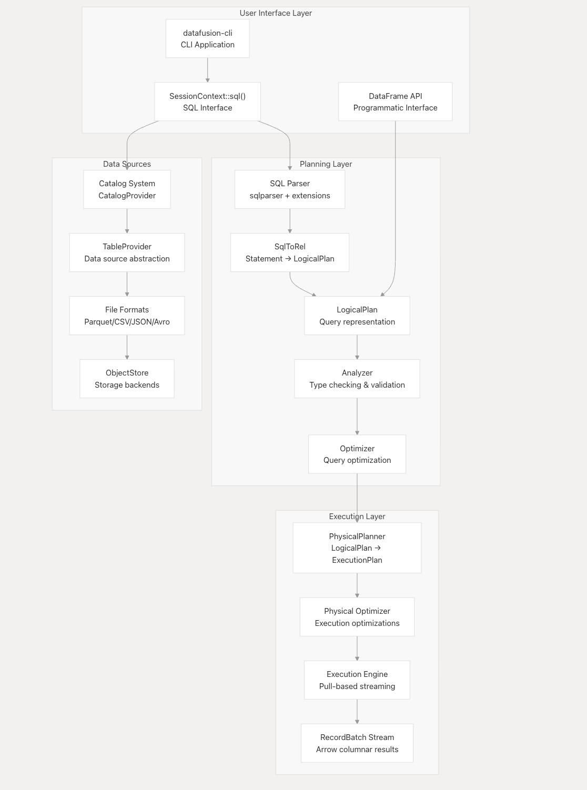

# Project 4: Reverse Engineering Report

##  Project Name : Apache Arrow DataFusion

##  Repository  : https://github.com/apache/datafusion

#  1. Project Overview and Key Components
##  Repository Analysis Summary

Apache Arrow DataFusion is an open-source, high-performance query execution engine written in Rust. It is designed to efficiently process analytical workloads using a columnar in-memory data format provided by Apache Arrow.

Unlike traditional database systems, DataFusion is not a standalone database but a **modular and embeddable query engine**. It can be integrated into various systems such as data platforms, analytics tools, and distributed query engines. This makes it highly flexible and reusable across different applications.

DataFusion supports both:
- **SQL queries** → for declarative data processing  
- **DataFrame API** → for programmatic and dynamic query construction  

This dual interface allows developers to choose between ease of use and fine-grained control.

---

##  Project Overview

The primary goal of DataFusion is to provide a **fast, extensible, and memory-efficient query engine** that can operate on large datasets.

It achieves this through:
- A **layered architecture** separating logical planning, optimization, and execution  
- A **streaming execution model** that processes data in chunks rather than loading everything into memory  
- Tight integration with **Apache Arrow**, enabling zero-copy data sharing and efficient computation  

DataFusion is widely used as a backend engine in modern data systems and can be embedded into applications requiring high-performance analytics.

---

##  Key Characteristics

The system emphasizes:

- **High Performance (Rust-based)**  
  Uses Rust for low-level control, enabling speed comparable to C/C++ while maintaining safety  

- **Memory Safety**  
  Eliminates common memory issues without relying on garbage collection  

- **Efficient Parallel Execution**  
  Supports multi-threaded execution for faster query processing  

- **Zero-Copy Data Sharing (Apache Arrow)**  
  Avoids unnecessary data duplication, improving speed and efficiency  

- **Modularity & Extensibility**  
  Components can be extended or replaced, making the system adaptable  

---

##  Why DataFusion Matters

DataFusion represents a modern approach to query engine design by combining:
- Systems-level performance (Rust)  
- Standardized data representation (Arrow)  
- Flexible interfaces (SQL + DataFrame API)  

This makes it suitable for building scalable, high-performance data processing systems.row  

---

##  Core Objectives

- Execute complex SQL queries efficiently  
- Provide a reusable and embeddable query engine  
- Support large-scale analytical workloads  
- Enable interoperability across systems using Apache Arrow  
- Offer both SQL and programmatic APIs for flexibility  

---

##  Architecture Overview

DataFusion follows a multi-stage query processing pipeline:

##  Query Processing Pipeline

  

DataFusion processes queries through a well-defined multi-stage pipeline. Each stage transforms the query into a more optimized and executable form.

---

###  Pipeline Stages

1️⃣ **Parsing**  
- Converts SQL text into an Abstract Syntax Tree (AST)  
- Uses `sqlparser::Parser`  
- Ensures syntactic correctness  

---

2️⃣ **Planning**  
- Transforms AST into a LogicalPlan  
- Uses `SqlToRel`  
- Represents the high-level structure of the query  

---

3️⃣ **Analysis**  
- Validates the LogicalPlan  
- Performs type checking and schema validation  
- Ensures query correctness before execution  

---

4️⃣ **Logical Optimization**  
- Applies rule-based optimizations  
- Examples:
  - Predicate Pushdown  
  - Column Pruning  
- Reduces data early in the pipeline  

---

5️⃣ **Physical Planning**  
- Converts LogicalPlan into ExecutionPlan  
- Decides how operations will be executed  
- Selects appropriate algorithms (e.g., joins)  

---

6️⃣ **Physical Optimization**  
- Optimizes ExecutionPlan further  
- Improves runtime efficiency  
- Adjusts execution strategies based on cost  

---

7️⃣ **Execution**  
- Executes the plan using the Rust engine  
- Produces results as a stream of RecordBatches  
- Uses Apache Arrow columnar format  

---

###  Key Insight

This pipeline clearly separates:
- **What to compute** → Logical Plan  
- **How to compute** → Physical Plan  

This separation enables:
- Better optimization  
- Higher performance  
- Flexible execution strategies  

---
###  Detailed Stage Explanation

### 1️⃣ SQL Parsing
- SQL queries are parsed into an Abstract Syntax Tree (AST) using a SQL parser  
- The AST represents the syntactic structure of the query in a hierarchical form  
- Ensures correctness of query syntax before further processing  

 *Role:* Converts raw user input into a structured representation that the system can understand  

---

### 2️⃣ Logical Plan
- Defines *what* needs to be computed without specifying how  
- Acts as an intermediate representation of the query  
- Independent of execution strategy and underlying hardware  

#### Example operations:
- Projection (select specific columns)  
- Filter (apply conditions using WHERE)  
- Join (combine multiple datasets)  
- Aggregation (GROUP BY, COUNT, SUM, etc.)  

 *Role:* Provides a high-level, optimized representation of the query logic  

---

### 3️⃣ Logical Optimization
- Applies rule-based transformations to improve efficiency before execution  
- Focuses on reducing data volume and computation early in the pipeline  

#### Examples:
- Predicate Pushdown → Moves filters closer to data source  
- Column Pruning → Removes unnecessary columns  
- Expression Simplification → Reduces computational complexity  

 *Impact:* Minimizes the amount of data processed in later stages, significantly improving performance  

---

### 4️⃣ Physical Planning
- Converts the logical plan into a physical execution plan  
- Determines *how* each operation will be executed  
- Selects appropriate algorithms based on data size, structure, and query type  

#### Algorithms:
- Hash Join → Efficient for equality-based joins  
- Sort-Merge Join → Useful when inputs are sorted  
- Nested Loop Join → Used for complex or fallback scenarios  

 *Role:* Maps abstract operations to concrete execution strategies  

---

### 5️⃣ Execution Engine
- Executes the physical plan using optimized Rust-based operators  
- Processes data in a streaming manner using RecordBatches (Apache Arrow)  

#### Features:
- Parallel execution across multiple threads  
- Streaming processing (chunk-wise execution)  
- Asynchronous runtime for non-blocking operations  

 *Outcome:* Efficient execution of queries with reduced memory usage and improved scalability  

---
##  Key Components

###  ExecutionPlan
- Core abstraction for physical operators  
- Defines how execution happens  

###  RecordBatchStream
- Streams data in chunks (batches)  
- Avoids loading entire dataset into memory  

###  Apache Arrow
- Columnar in-memory format  
- Enables zero-copy data sharing  
- Improves cache efficiency  

###  Optimizer
- Rule-based system for improving query plans  
- Reduces computation cost  

###  FFI Layer (Foreign Function Interface)
- Enables communication between Rust and Python  
- Handles data exchange using Arrow format  

---

##  Execution Model

DataFusion uses a **streaming execution model**, meaning:
- Data is processed in chunks (RecordBatches)  
- Results are produced incrementally  
- Memory usage is minimized  

It also uses **asynchronous execution**, allowing:
- Non-blocking operations  
- Better CPU utilization  
- Efficient handling of I/O tasks  

---

##  Language Integration

- Core engine → Rust (performance + safety)  
- Python API → usability and ecosystem support  

Communication between them happens via:
- Arrow FFI (zero-copy)  
- Serialized data (when needed)  

---

#  2. Question-wise Solutions

To maintain clarity and avoid clutter, each question is answered in a separate markdown file.

## 📁 Structure

Please refer to the following files:

- [Q1.md](./Q1.md) → Rust vs Python design decision  (Q1.md)
- [Q2.md](./Q2.md) → Why Apache Arrow format  (Q2.md)
- [Q3.md](./Q3.md) → Join algorithm selection  (Q3.md)
- [Q4.md](./Q4.md) → Logical vs physical optimization  (Q4.md)
- [Q5.md](./Q5.md) → Importance of optimization order  (Q5.md)
- [Q6.md](./Q6.md) → Logical vs physical plan separation (Q6.md) 
- [Q7.md](./Q7.md) → Handling multiple data formats  (Q7.md)
- [Q8.md](./Q8.md) → Cardinality estimation challenges  (Q8.md)
- [Q9.md](./Q9.md) → Join ordering problem  (Q9.md)
- [Q10.md](./Q10.md) → SQL vs DataFrame API  (Q10.md)

Each file contains:
- Detailed explanation  
- Technical reasoning  
- System design insights  

---

#  3. Findings and Conclusion

## ✅ 1. Rust as Core Engine

- Provides high performance comparable to C/C++  
- Ensures memory safety without garbage collection  
- Enables safe multi-threading using `Send` and `Sync`  
- Avoids Python’s GIL limitations  

---

## ✅ 2. Apache Arrow as Standard Format

- Columnar format improves analytical query performance  
- Enables zero-copy data sharing across systems  
- Avoids redundant data conversions  
- Acts as a universal in-memory data representation  

---

## ✅ 3. Separation of Logical and Physical Plans

- Logical plan → defines *what* to compute  
- Physical plan → defines *how* to compute  

Benefits:
- Flexibility in optimization  
- Easier maintainability  
- Better execution strategies  

---

## ✅ 4. Importance of Query Optimization

- Reduces data size early  
- Improves execution speed  
- Avoids unnecessary computations  

Order of optimizations matters because:
- Some transformations enable others  
- Incorrect order can reduce effectiveness  

---

## ✅ 5. Multiple Join Algorithms

Different join strategies are optimal for different scenarios:

- **Hash Join** → Efficient for equality joins  
- **Sort-Merge Join** → Suitable for sorted data  
- **Nested Loop Join** → Fallback for complex conditions  

---

## ✅ 6. Streaming Execution Model

- Processes data in chunks  
- Avoids loading entire dataset into memory  
- Supports large-scale data processing  

---

## ✅ 7. Handling Multiple Data Formats

DataFusion converts input formats (CSV, JSON, Parquet) into Arrow:

- Conversion is done in a streaming manner  
- Avoids full data materialization  
- Maintains efficiency  

---

## ✅ 8. Cardinality Estimation Challenges

Estimating row counts is difficult because:

- Data distribution is often unknown  
- Column correlations are not explicit  

Incorrect estimates lead to:
- Poor query plans  
- Slower execution  

---

## ✅ 9. Join Ordering Complexity

Join ordering is challenging because:

- Number of possible orders grows exponentially  
- Exhaustive search is impractical  

DataFusion uses heuristics to:
- Reduce search space  
- Choose near-optimal plans  

---

## ✅ 10. SQL vs DataFrame API

### SQL:
- Declarative and easy to use  

### DataFrame API:
- More flexible and programmable  
- Enables dynamic query construction  

---
##  Final Conclusion

Apache Arrow DataFusion represents a state-of-the-art approach to building analytical query engines by combining efficient system design, modern programming paradigms, and high-performance data processing techniques.

At its core, DataFusion leverages Rust to achieve low-level performance with strong memory safety guarantees, eliminating common issues such as memory leaks and thread safety bugs. The adoption of Apache Arrow as a standardized in-memory columnar format enables zero-copy data sharing and significantly improves cache efficiency, which is critical for analytical workloads.

The architecture of DataFusion is built around a clear separation of concerns, distinguishing between logical planning (what to compute) and physical execution (how to compute). This layered approach allows the optimizer to apply multiple transformations, select appropriate execution strategies, and adapt dynamically based on query characteristics.

Additionally, the use of a streaming execution model ensures that large datasets can be processed efficiently without requiring full materialization in memory. Combined with parallel execution and asynchronous processing, this makes DataFusion highly scalable and suitable for modern data-intensive applications.

Overall, DataFusion demonstrates how thoughtful integration of system-level design principles—such as modularity, abstraction, and optimization—can result in a flexible, extensible, and high-performance query engine.

---

##  Key Takeaways

- **System design plays a critical role** in building scalable and efficient data processing systems  
- **Separation of logical and physical plans** enables better optimization and flexibility  
- **Apache Arrow standardization** allows zero-copy data sharing and interoperability across systems  
- **Optimization strategies and their ordering** directly influence query performance  
- **Multiple execution strategies (e.g., join algorithms)** are necessary to handle diverse workloads  
- **Streaming execution models** are essential for handling large-scale data efficiently  
- **Parallelism and async execution** improve resource utilization and performance  
- **Combining low-level efficiency (Rust) with high-level usability (SQL & APIs)** creates powerful and practical systems  

---

##  Author

**Tanisha Jhalani**  
_Data Science Intern_